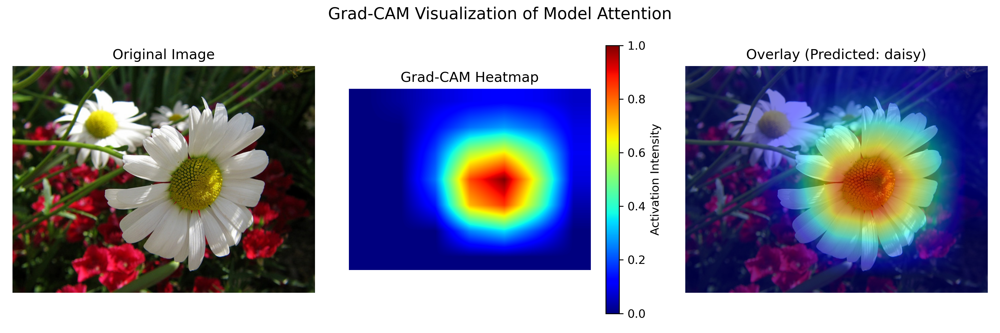
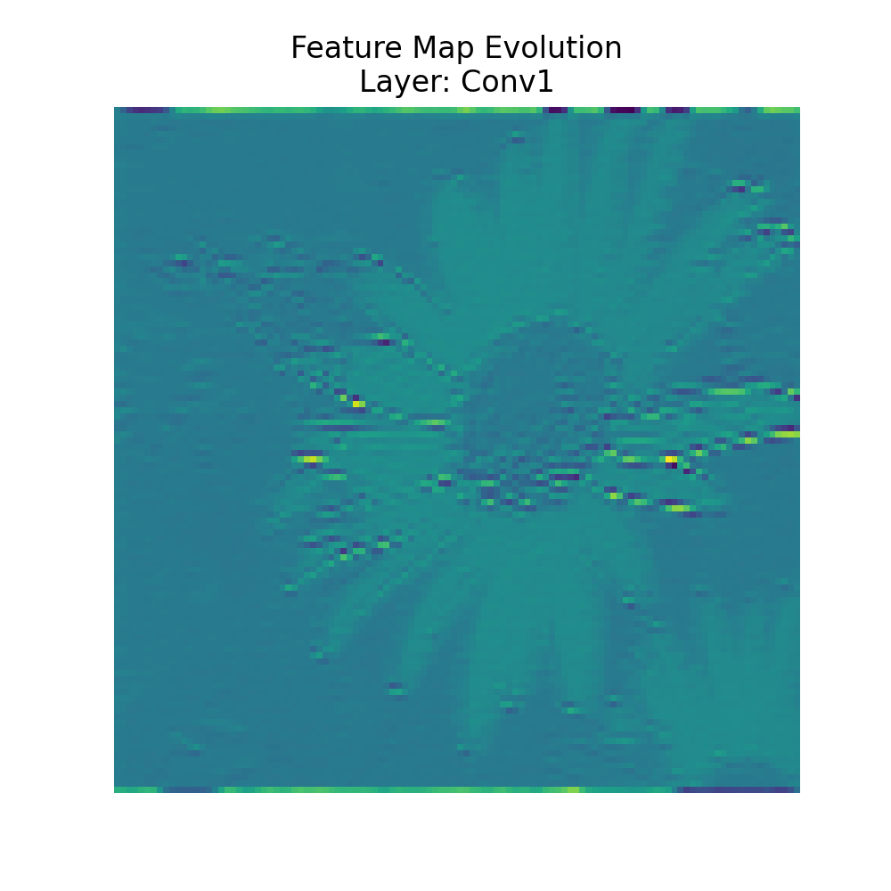
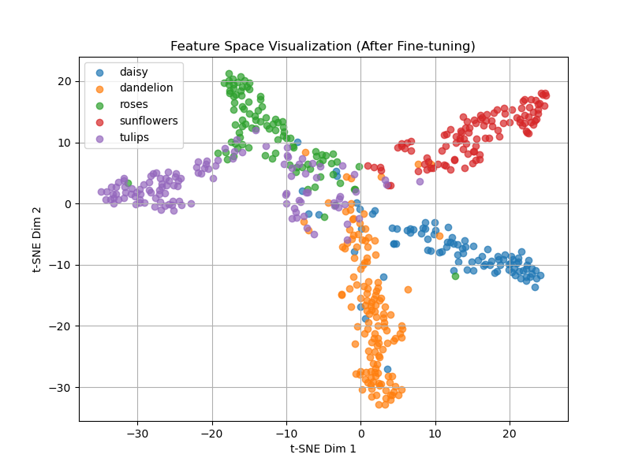
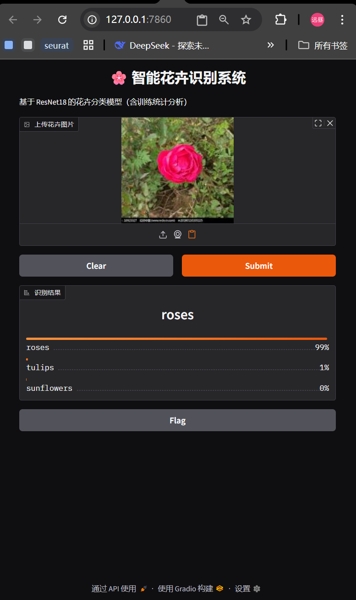

# 基于深度学习的花卉图像分类项目

## 1. 项目简介

本项目实现了一个基于深度学习的花卉图像分类系统，  
目标是对输入的花卉图片进行类别识别。

项目采用卷积神经网络对图像进行特征提取与分类，  
并在训练完成后，对模型性能及中间计算过程进行了可视化分析。

本项目主要关注模型训练流程的完整性与结果展示的可解释性。

---

## 2. 数据集说明

实验使用的花卉数据集包含五个类别：

- daisy（雏菊）
- dandelion（蒲公英）
- roses（玫瑰）
- sunflowers（向日葵）
- tulips（郁金香）

数据集采用常见的图像分类目录结构，  
并划分为训练集、验证集和测试集：

---

## 3. 模型与训练方法

### 3.1 模型结构

本项目采用 ResNet-18 作为基础网络结构：

* 使用 ImageNet 预训练权重进行初始化
* 将最后的全连接层修改为 5 类输出

模型由 PyTorch 框架实现。

---

### 3.2 训练设置

* 输入图像尺寸：224 × 224
* 损失函数：交叉熵损失（Cross Entropy Loss）
* 优化器：Adam
* 训练过程中记录训练集与验证集的损失和准确率

训练过程中，模型参数及训练日志会被保存，以便后续分析。

---

## 4. 模型性能评估

在训练完成后，使用测试集对模型进行性能评估。

评估内容包括：

* 分类准确率
* 混淆矩阵（Confusion Matrix）

混淆矩阵用于观察不同类别之间的分类情况。

> **混淆矩阵可视化结果**
>
---

## 5. 模型可解释性分析与可视化

为分析模型在预测过程中的行为，本项目对模型的中间结果进行了可视化。

---

### 5.1 Grad-CAM 可视化

采用 Grad-CAM 方法对模型预测结果进行分析，
可视化模型在进行分类判断时主要关注的图像区域。

该方法有助于理解模型预测结果的来源。

> **Grad-CAM 可视化示例**
>
---

### 5.2 中间特征演化动画展示

从网络的不同层提取中间特征图，
并使用 Matplotlib Animation 将其组织为动画形式。

该动画展示了输入图像在网络中逐层处理时特征表示的变化过程。

> **中间特征演化动画（GIF）**
> 
---

### 5.3 特征空间可视化（t-SNE）

提取模型输出的高维特征，
使用 t-SNE 方法将其降维到二维空间进行展示。

通过该可视化，可以观察不同类别样本在特征空间中的分布情况。

> **t-SNE 特征分布图**
> 
---

## 6. 图形化使用界面

项目使用 Gradio 构建了简单的图形化推理界面。

用户可以通过网页上传花卉图片，
系统会返回模型预测的类别结果。

> **Gradio 推理界面示例**
> 

---

## 7. 项目总结

本项目完成了一个完整的花卉图像分类流程，
包括数据处理、模型训练、性能评估、可解释性分析以及结果可视化。
